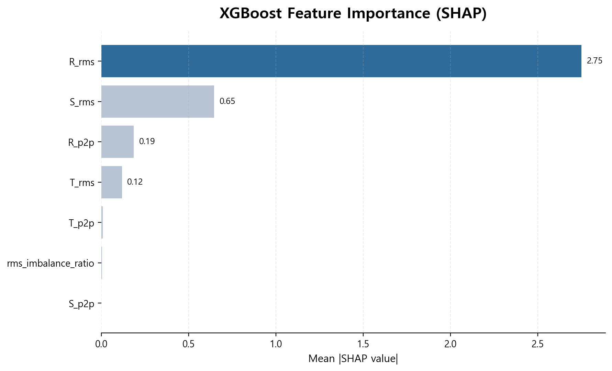
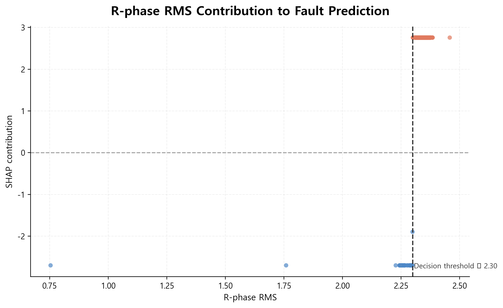

# 3상 전류 센서 기반 기계 고장 탐지

AI Hub의 **기계시설물 고장 예지 센서 데이터**를 활용해, 3상 전류(raw current) 신호를 직접 전처리하고 설비별 고장 탐지 가능성을 검증한 프로젝트입니다.

> 교육 과정에서 제공된 FeatureExtractor에 의존하지 않고, raw sensor → 품질 검증 → feature engineering → 수집 편향 점검 → 모델 검증 → 해석 과정을 직접 재구성한 V2 프로젝트입니다.

## 1. 프로젝트 목적

초기 목표는 정상 / 축정렬불량 / 회전체불평형 / 베어링불량을 분류하는 것이었습니다. 하지만 EDA 과정에서 일부 설비의 **정상과 고장 데이터가 서로 다른 날짜에 수집되어 있다는 수집 편향(confounding)** 을 확인했습니다.

따라서 단순한 다중분류 성능을 높이는 대신 다음 질문에 집중했습니다.

1. raw 3상 전류 신호에서 설명 가능한 특징을 직접 만들 수 있는가?
2. 데이터 품질 문제와 수집 편향을 사전에 탐지할 수 있는가?
3. 날짜가 달라져도 고장 탐지 성능이 유지되는가?
4. 복잡한 모델이 정말 필요한가?

## 2. 데이터

- 출처: AI Hub `기계시설물 고장 예지 센서`
- 분석 모달리티: **Current**
- Sample Rate: **2,000 Hz**
- Data Length: **2,000**
- 한 파일 = 약 **1초 길이의 3상(R/S/T) 전류 신호**

동일 설비에서 정상과 고장을 비교하기 위해 아래 조합을 사용했습니다.

| Equipment | 비교 상태 |
|---|---|
| L-DSF-01 | 정상 vs 축정렬불량 |
| L-EF-04 | 정상 vs 회전체불평형 |
| L-SF-04 | 정상 vs 베어링불량 |

초기 구축 샘플은 각 상태 500개 기준 총 3,000개였으며, 품질 검사 후 7개의 극단적인 저신호 샘플을 제외해 **2,993개**를 유지했습니다.

> 원본 데이터는 용량과 배포 조건 때문에 저장소에 포함하지 않습니다.

## 3. Raw CSV 구조

원본 파일은 메타데이터 9행 이후에 시계열 신호가 이어지는 구조입니다.

```text
Date,2020-11-04 13:13:29
Filename,...
Data Label,정상
Label No,00
Motor Spec,L-CAHU-01R,1750,11,22,
Period,1SEC
Sample Rate,2000
RMS,16.94683,17.14157,15.07475,
Data Length,2000,
0,7.5673828125,15.9755859375,-19.859375,
...
```

메타데이터 행마다 열 수가 달라 앞 9행은 `csv.reader`로 별도 파싱하고, 신호 영역은 R/S/T 컬럼만 읽도록 구성했습니다.

## 4. 전처리 및 Feature Engineering

### 데이터 품질 검사

각 phase별 RMS, exact-zero ratio, mean RMS, 최대 zero ratio를 확인했습니다.

탐색 기준:

```python
(mean_rms < 0.5) | (max_zero_ratio > 0.5)
```

이 기준은 산업 표준이 아니라 **EDA를 위한 탐색적 기준**입니다. 검사 결과 7개 샘플이 극단적인 저신호 상태였고 모두 `L-DSF-01 / 정상`에 존재했습니다. 원인은 센서 오류라고 단정하지 않고 정지/전이 상태 또는 수집 조건 차이 가능성을 고려해, 원본은 보존하되 모델링에서는 제외했습니다.

### 시간영역 특징

후보 특징:
- RMS
- Standard Deviation
- Peak-to-Peak
- Skewness
- Kurtosis
- Crest Factor
- RMS imbalance ratio

3상 전류에서 평균이 거의 0에 가까운 교류 파형이기 때문에 `RMS² = Variance + Mean²` 관계상 RMS와 STD가 거의 중복되는 것을 확인했습니다.

## 5. 가장 중요한 EDA: 수집 편향 발견

`L-EF-04`에서는 정상과 회전체불평형 데이터의 수집 날짜가 겹치지 않았습니다. `L-SF-04`는 정상은 2020년 11월, 베어링불량은 2021년 1월에 수집되어 정상/고장과 수집 시점이 완전히 분리되어 있었습니다.

따라서 높은 분류 성능이 나오더라도 고장 상태가 아니라 수집 세션/날짜를 학습했을 가능성을 배제하기 어렵습니다. 최종 모델링은 **정상과 축정렬불량이 같은 날짜에 공존하는 L-DSF-01**을 중심으로 수행했습니다.

## 6. L-DSF-01 분석

동일 설비, 동일 RPM(1730) 조건에서 정상과 축정렬불량을 비교했습니다.

### 날짜 통제 회귀

| Feature | OLS fault coefficient |
|---|---:|
| R_rms | +0.1328 |
| S_rms | +0.1098 |
| T_rms | +0.1260 |

Median Quantile Regression에서도 같은 방향이 유지되었습니다.

| Feature | Quantile Regression coefficient |
|---|---:|
| R_rms | +0.0848 |
| S_rms | +0.0675 |
| T_rms | +0.0737 |

> 본 결과는 상관/분리 경향을 의미하며, 축정렬불량이 RMS 증가의 인과적 원인임을 증명하는 것은 아닙니다.

## 7. Feature Set 비교

XGBoost + 동일 Group CV 기준:

| Feature Set | Balanced Accuracy | Std | Macro F1 |
|---|---:|---:|---:|
| phase_7 | 0.9988 | 0.0017 | 0.9915 |
| phase_plus_imbalance_8 | 0.9988 | 0.0017 | 0.9915 |
| compact_4 | 0.9378 | 0.0316 | 0.8566 |

`phase_7`: `R_rms, S_rms, T_rms, R_p2p, S_p2p, T_p2p, rms_imbalance_ratio`

## 8. Baseline 모델 비교 (compact_4)

먼저 3상 대표값으로 압축한 `compact_4` feature set을 사용해
동일한 날짜 그룹 분할 조건에서 모델 계열별 성능을 비교했습니다.

| Model | BA mean | BA std | Macro F1 |
|---|---:|---:|---:|
| XGBoost | 0.9378 | 0.0316 | 0.8566 |
| LightGBM | 0.9125 | 0.0615 | 0.9286 |
| Logistic Regression | 0.9004 | 0.0916 | 0.8178 |
| Random Forest | 0.8106 | 0.1923 | 0.7838 |

이후 phase별 정보를 유지한 `phase_7` feature set에서 XGBoost Balanced Accuracy가
0.9988까지 향상되어, 상별 정보 손실이 성능에 영향을 주는 것을 확인했습니다.

## 9. Leave-One-Day-Out 검증

같은 날짜 데이터가 train/test에 동시에 들어가지 않도록 하루 전체를 테스트셋으로 제외하는 검증을 수행했습니다.

XGBoost `phase_7` 기준:
- Mean Balanced Accuracy: **0.9988**
- Std: **0.0036**
- 9개 날짜 중 8개 날짜에서 BA = **1.0**
- 2020-11-12: BA = **0.9891**

## 10. 복잡한 모델이 정말 필요한가?

| Model | OOF BA | OOF Macro F1 | Day BA mean | Day BA std |
|---|---:|---:|---:|---:|
| R_rms Decision Stump | **1.0000** | **1.0000** | **1.0000** | **0.0000** |
| Logistic phase_7 | 0.9932 | 0.9657 | 0.9907 | 0.0137 |
| XGBoost phase_7 | 0.9986 | 0.9928 | 0.9988 | 0.0034 |

Decision Stump 규칙:

```text
R_rms <= 2.30  -> 정상
R_rms >  2.30  -> 축정렬불량
```

현재 분석 범위에서는 복잡한 모델보다 **R상 RMS 하나를 이용한 단순 임계값 모델이 더 높은 성능과 설명 가능성**을 보였습니다.

## 11. 모델 해석: SHAP

XGBoost의 예측 기준을 확인하기 위해 TreeSHAP 기반 feature contribution을 분석했습니다.

### 11.1 SHAP Feature Importance

`R_rms`가 가장 높은 예측 기여도를 보였고, `S_rms`가 그 다음으로 나타났습니다.  
반면 P2P 및 imbalance 계열 feature의 상대적 기여도는 낮았습니다.



### 11.2 R-phase RMS와 예측 방향

`R_rms`가 약 `2.30` 이하일 때는 정상(class 0) 방향으로,  
`2.30`을 초과하면 축정렬불량(class 1) 방향으로 예측 기여도가 크게 변했습니다.



이 결과는 depth-1 Decision Tree에서 확인한 다음 분리 기준과 일관됩니다.

```text
R_rms <= 2.30  → 정상
R_rms >  2.30  → 축정렬불량
```

## 12. 최종 결론

이 프로젝트의 핵심은 높은 분류 점수 자체보다 **데이터 검증 과정**에 있습니다.

- raw 3상 전류에서 직접 AI-ready feature 생성
- 극단적인 저신호 샘플 탐지 및 모델링 제외
- 정상/고장 수집 날짜가 완전히 분리된 설비 발견
- 잘못된 4-class 분류 대신 분석 범위 재설계
- 날짜 단위 Group CV 및 Leave-One-Day-Out 검증
- 복잡한 XGBoost보다 단순 R_rms 임계값 모델로도 충분함을 확인
- SHAP을 통해 XGBoost 역시 R_rms를 핵심 판단 근거로 사용함을 확인

## 13. 한계

- 분석 대상은 `L-DSF-01`, 1730 RPM, 현재 확보한 수집 기간에 한정
- 부하(load), 환경 조건 등 일부 잠재적 교란변수 미확인
- 다른 설비/회전수/운전조건에서 외부 검증 필요
- EF/SF는 정상/고장 수집 시점이 분리되어 고장 효과로 직접 해석하지 않음
- 주파수영역 1X/2X/3X 및 band energy는 시간영역 RMS보다 추가 분리력이 제한적이었음

따라서 `R_rms > 2.30`을 산업 전반에 적용 가능한 고장 임계값으로 해석하지 않습니다.

## 14. Repository Structure

```text
motor-current-fault-detection/
├─ README.md
├─ requirements.txt
├─ .gitignore
├─ src/
│  ├─ preprocessing.py
│  ├─ modeling.py
│  └─ shap_analysis.py
├─ results/
│  ├─ model_comparison.csv
│  └─ feature_set_comparison.csv
└─ figures/
   ├─ shap_feature_importance.png
   ├─ r_rms_shap_contribution.png
   └─ README.md
```

## 15. 실행 순서

```bash
pip install -r requirements.txt
python src/preprocessing.py --data_dir "YOUR_DATA_DIR" --output "ai_ready_features.csv"
python src/modeling.py --features_csv "ai_ready_features.csv"
python src/shap_analysis.py --features_csv "ai_ready_features.csv"
```

## 16. Tech Stack

Python, pandas, NumPy, SciPy, scikit-learn, XGBoost, LightGBM, Matplotlib

## 17. 데이터 출처

AI Hub **기계시설물 고장 예지 센서**

원본 데이터는 저장소에 포함하지 않습니다.
